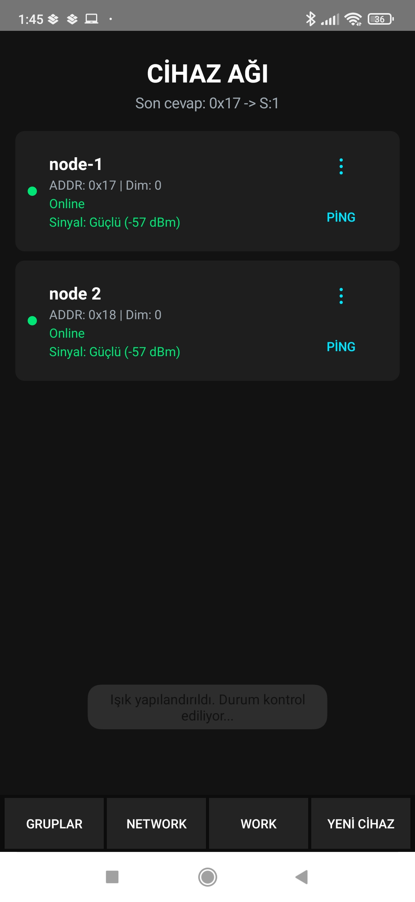
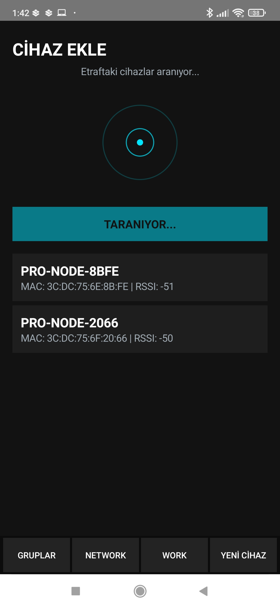
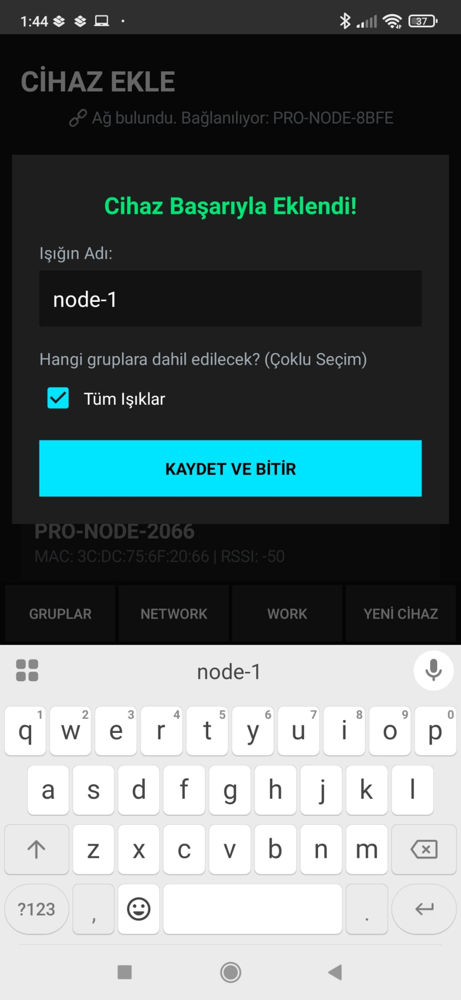
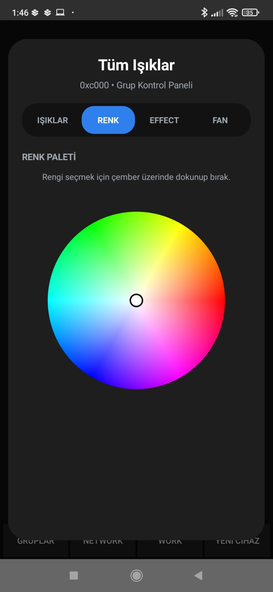
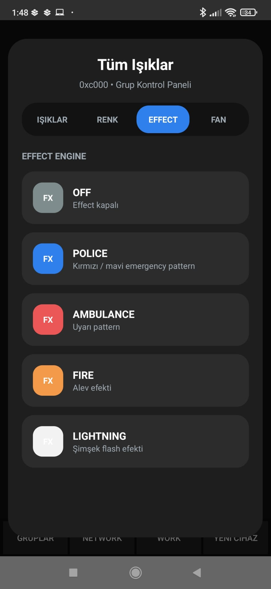
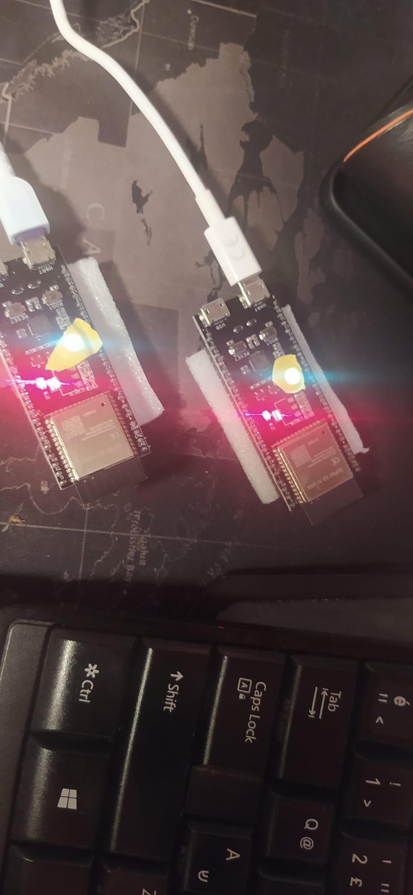
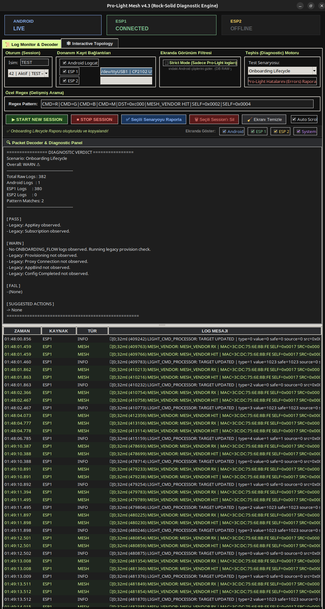

# Pro-Light Node Showcase


> This repository contains the public-facing architecture, diagnostics workflows, development notes, screenshots, and infrastructure overview for the Pro-Light Node project.
>
> The core firmware and production mesh implementation are currently maintained in a separate private repository while the system architecture is actively evolving.

Pro-Light Node is an ESP32-S3 based BLE Mesh lighting infrastructure project designed for scalable professional lighting systems.

The long-term vision is to create a lightweight, production-oriented lighting ecosystem inspired by professional synchronized lighting platforms such as Sidus Link, while remaining accessible to independent developers, makers, and small production teams.

---

# What This Repository Contains

This public showcase repository includes:

- architecture overview
- development screenshots
- hardware testing evidence
- Android control interface screenshots
- provisioning workflow documentation
- diagnostic workflow notes
- NotebookLM-assisted engineering context
- public roadmap and production goals

This repository does **not** contain the current private firmware source code.

---

# Android Mesh Network Interface



Production-oriented Android mesh control interface with:

- real-time node visibility
- RSSI monitoring
- online/offline lifecycle tracking
- mesh diagnostics
- node management workflows

---

# Device Discovery and Provisioning

## Device Discovery



## Provisioning Workflow



The onboarding architecture focuses on:

- controlled provisioning
- production-safe lifecycle handling
- group assignment
- scalable node management
- future large-scale deployment support

---

# Real-Time RGB Control



Low-latency RGB control system supporting:

- group lighting control
- distributed mesh commands
- real-time color workflows
- synchronized lighting behaviors

---

# Effect Engine



Experimental synchronized effect infrastructure supporting:

- distributed lighting effects
- scheduler-driven execution
- future cue/timeline systems
- coordinated multi-node behavior

---

# Real Hardware Testing



The project is actively tested on real ESP32-S3 hardware during architecture iteration and mesh reliability development.

Current testing areas include:

- BLE Mesh reliability
- multicast/group delivery behavior
- synchronization workflows
- runtime telemetry
- production-safe node lifecycle handling

---

# Runtime Diagnostic Engine



Custom runtime diagnostic and packet analysis tooling is used for:

- BLE Mesh lifecycle debugging
- packet inspection
- synchronization analysis
- onboarding diagnostics
- runtime telemetry analysis
- Android + ESP trace correlation
- large-scale reasoning workflows

The diagnostic tooling itself is currently maintained privately while selected public documentation and screenshots are shared here.

---

# Project Goals

- Stable BLE Mesh communication
- Reliable group/unicast command delivery
- Time-synchronized lighting effects
- Production-grade node lifecycle management
- Scalable multi-node lighting architecture
- Real-world hardware testing
- Low-latency lighting control workflows
- Reproducible diagnostics and trace analysis

---

# Architecture Overview

The private firmware is structured around modular embedded subsystems.

```text
src/
 ├── control/
 │    ├── command/
 │    ├── health/
 │    ├── render/
 │    └── safety/
 │
 ├── effects/
 │
 ├── fan/
 │
 ├── hardware/
 │
 ├── mesh/
 │    ├── core/
 │    ├── manager/
 │    └── vendor/
 │
 ├── protocol/
 │
 ├── telemetry/
 │
 ├── thermal/
 │
 └── time_sync/
```

---

# Core Architectural Areas

## Mesh Infrastructure

Responsible for BLE Mesh lifecycle, vendor model communication, transport behavior, and node coordination.

## Protocol Infrastructure

Responsible for packet interpretation, command abstraction, protocol evolution, and compatibility between Android control logic and ESP32 nodes.

## Command and Scheduler Systems

Responsible for command processing, scheduled execution, future cue systems, and synchronized multi-node behavior.

## Runtime Safety and Health

Responsible for safe command execution, node health monitoring, thermal/fan integration, and production-oriented runtime validation.

## Telemetry and Diagnostics

Responsible for structured runtime visibility, trace correlation, debugging workflows, and future production monitoring.

## Synchronization Infrastructure

Responsible for time synchronization experiments and coordinated execution across multiple lighting nodes.

---

# Structured Diagnostic Workflows

This repository includes public diagnostic and reasoning resources under:

```text
notebooklm_sources/
```

These resources contain:

- Android lifecycle traces
- provisioning flow documentation
- protocol analysis notes
- synchronization debugging workflows
- ESP runtime diagnostics
- telemetry reasoning references
- architecture context bundles

The goal is to support reproducible debugging and large-scale system reasoning during embedded mesh infrastructure development.

---

# Tech Stack

- ESP32-S3
- ESP-IDF
- PlatformIO
- Bluetooth Mesh
- Vendor Models
- FreeRTOS
- Kotlin Android
- BLE GATT
- Custom Vendor Protocols
- Structured diagnostics workflows

---

# Development Philosophy

This project prioritizes:

- stability over shortcuts
- architecture over temporary fixes
- real hardware validation
- reproducible debugging
- production-oriented infrastructure
- maintainable subsystem separation
- privacy-conscious progressive open-sourcing

---

# Project Status

Active development.

The core firmware is developed privately while this repository tracks public architecture, documentation, diagnostics, roadmap, and showcase materials.

Main ongoing areas:

- mesh reliability
- synchronization systems
- telemetry infrastructure
- distributed scheduling
- node lifecycle management
- production diagnostics

---

# Roadmap

## Phase 1 — Core Stability

- [x] BLE Mesh vendor communication
- [x] Group command support
- [x] Unicast command support
- [x] RGB lighting control
- [x] Master dimmer support
- [x] Real hardware testing

## Phase 2 — Protocol Infrastructure

- [x] Protocol decoder architecture
- [x] Command scheduling design
- [x] Time synchronization experiments
- [x] Telemetry bridge foundation

## Phase 3 — Production Architecture

- [ ] Reliable multi-node synchronization
- [ ] Production-grade online/offline detection
- [ ] Scheduler safety improvements
- [ ] Structured diagnostics
- [ ] Node recovery strategies
- [ ] Mesh congestion handling

## Phase 4 — Progressive Open Source Release

- [ ] Publish stable protocol documentation
- [ ] Publish selected diagnostic examples
- [ ] Publish sanitized architecture notes
- [ ] Open-source selected non-sensitive utilities
- [ ] Evaluate release of stable firmware modules

## Phase 5 — Advanced Lighting Infrastructure

- [ ] Scene engine
- [ ] Cue timeline system
- [ ] Distributed synchronized effects
- [ ] Large-scale node orchestration
- [ ] Mobile control integration

---

# License

MIT License
